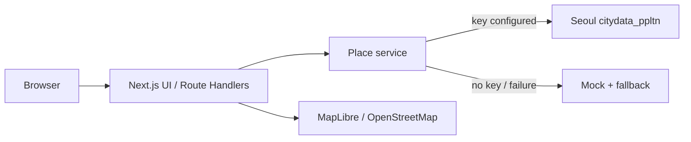

# 지금어디 — 서울 실시간 혼잡도 장소 추천 MVP

서울 주요 장소의 **혼잡도 + 예상 인구 + 목적 적합도 + 거리**를 한 화면에서 비교해 “지금 어디 갈지” 결정하도록 돕는 Next.js 프로젝트입니다.

[](https://vercel.com/new/clone?repository-url=https%3A%2F%2Fgithub.com%2FbeerAndNacho%2Fplace-to-recommend-something)

- Repository: `beerAndNacho/place-to-recommend-something`
- Framework: Next.js App Router + TypeScript
- Map: MapLibre GL + OpenStreetMap
- Data: 서울 열린데이터광장 `citydata_ppltn` 또는 내장 Mock/Fallback

## 구현 범위

- 모바일 우선 반응형 UI
- 추천 리스트 / 지도 전환
- 장소 검색
- 데이트, 산책, 핫플, 한적한 곳, 가족, 야간, 사진 필터
- 추천순, 여유순, 붐빔순, 가까운순 정렬
- 브라우저 Geolocation 기반 거리 계산
- 혼잡도 색상 마커와 선택 연동
- 장소별 상세 페이지
- 시간대별 예상 인구 그래프
- API key 유무 자동 전환
- 실데이터 실패 시 장소별 Mock fallback
- SEO metadata, sitemap, robots
- GitHub Actions 타입 검사 + production build

## 데이터 모드

```text
SEOUL_API_KEY 없음
  └─ 10개 장소 전체 Mock 데이터

SEOUL_API_KEY 있음
  └─ 서울 citydata_ppltn 호출
      ├─ 성공: 실데이터
      └─ 실패: 해당 장소만 Mock fallback
```

API 키는 서버에서만 읽으며 브라우저 번들에 포함되지 않습니다.

## 로컬 실행

```bash
npm install
cp .env.example .env.local
npm run dev
```

브라우저에서 `http://localhost:3000`을 엽니다. API 키가 없어도 전 기능을 테스트할 수 있습니다.

## 실데이터 연결

서울 열린데이터광장에서 인증키를 발급한 뒤 `.env.local` 또는 Vercel 환경변수에 넣습니다.

```env
SEOUL_API_KEY=발급받은키
SEOUL_API_CACHE_SECONDS=900
SEOUL_LIVE_PLACE_LIMIT=10
NEXT_PUBLIC_SITE_URL=https://your-domain.vercel.app
```

기본값은 10개 장소를 장소별 15분 캐시합니다. 무료 호출량을 보호하기 위한 설정이며, 운영 트래픽과 할당량에 맞춰 조정할 수 있습니다.

## 주요 경로

| 경로 | 설명 |
|---|---|
| `/` | 추천 중심 메인 화면 |
| `/crowd` | 실시간 탐색 화면 |
| `/place/[slug]` | 장소별 상세/SEO 페이지 |
| `/api/places` | 전체 장소 데이터 |
| `/api/places/[slug]` | 장소 하나의 데이터 |
| `/api/health` | 배포 상태와 데이터 모드 확인 |

## 아키텍처



프론트는 서울 API 원본 응답을 직접 사용하지 않습니다. `lib/seoul-api.ts`가 응답을 공통 `Place` 타입으로 변환하므로, 추후 부산·제주 데이터 소스를 추가해도 화면 컴포넌트는 유지할 수 있습니다.

## 디자인 시스템

- 배경: 따뜻한 라이트 그레이
- Primary: violet/indigo
- 혼잡도: 여유(초록), 보통(파랑), 약간 붐빔(주황), 붐빔(빨강)
- 큰 라운드 카드, 얇은 경계선, 약한 그림자
- 데스크톱: 좌측 추천 리스트 + 우측 지도
- 모바일: 추천 / 지도 segmented control

## 검증

```bash
npm run typecheck
npm run build
# 또는
npm run verify
```

`main` push와 PR에서 동일한 검증이 GitHub Actions로 실행됩니다.

## Vercel 배포

1. Vercel에서 이 GitHub 저장소를 Import합니다.
2. Framework Preset은 Next.js를 사용합니다.
3. API 키 없이 먼저 배포해 Mock 모드를 확인합니다.
4. 실데이터 사용 시 Project Settings → Environment Variables에 `SEOUL_API_KEY`를 추가합니다.
5. `NEXT_PUBLIC_SITE_URL`에 실제 배포 URL을 넣고 재배포합니다.

## 운영 참고

- 서울 실시간 인구는 통신 기반 추정·집계 데이터이므로 실제 현장과 차이가 날 수 있습니다.
- OpenStreetMap 공개 타일은 MVP와 저트래픽 검증용입니다. 트래픽 증가 시 상용/자체 타일 공급자로 교체하세요.
- `SEOUL_SUBWAY_API_KEY`는 향후 지하철 도착 기능 확장용으로만 예약되어 있습니다.
